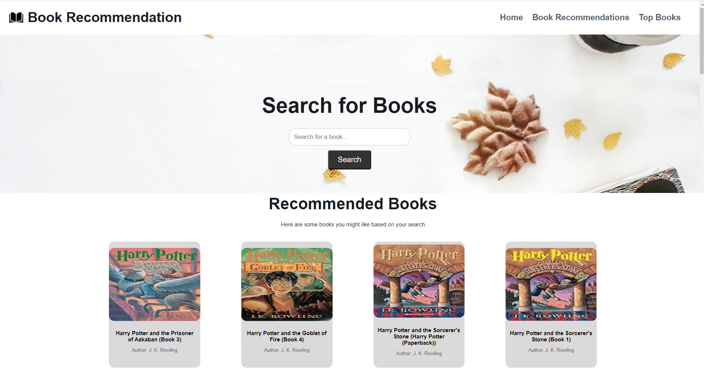

# Book Recommendation System

This repository contains a Python-based book recommendation system that leverages collaborative filtering to suggest books based on user preferences.

## Overview

The system uses data from various sources to provide personalized book recommendations. It calculates the popularity of books based on the number of ratings and average ratings received. The core functionality relies on cosine similarity to find books similar to those previously liked by the user.

## Prerequisites

To run this project, ensure you have the following installed:

- Python 3.x
- Pandas
- NumPy
- Matplotlib
- Seaborn
- Scikit-learn

## Installation

Clone the repository:

git clone https://github.com/yourusername/book-recommendation-system.git cd book-recommendation-system

Create a virtual environment (optional but recommended):

python -m venv env source env/bin/activate # On Windows use env\Scripts\activate

Install the required packages

## Usage

Before running the recommendation system, ensure you have the necessary CSV files (`Books.csv`, `Ratings.csv`, `Users.csv`) in the `data` directory.

Run the main script:

python main.py

This will load the data, preprocess it, calculate book popularity, and generate recommendations based on the collaborative filtering approach.

## Contributing

Contributions are welcome Please feel free to submit a pull request or open an issue if you encounter any problems or have suggestions for improvement.

